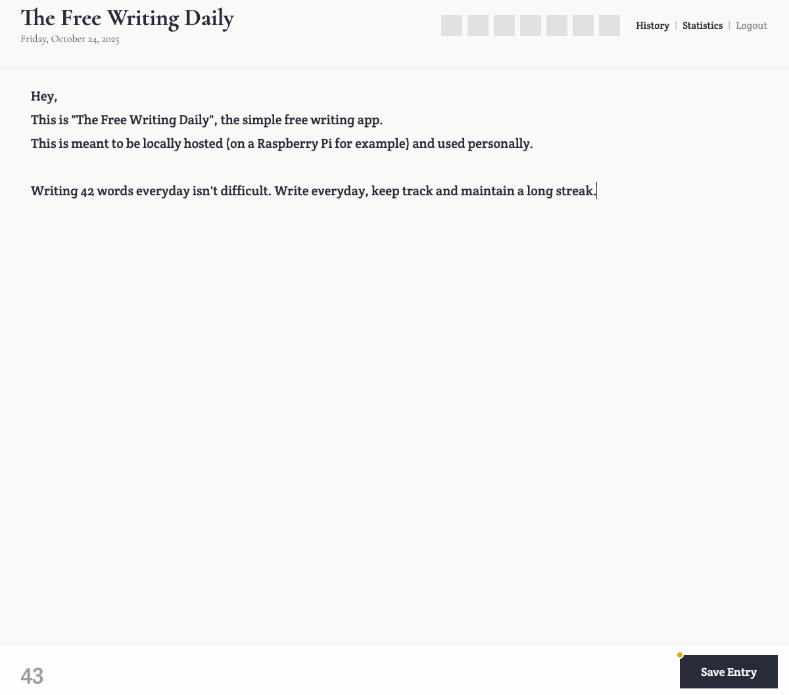

## The Freewriting Daily

A freewriting app I built for my raspberry pi. This is just personal and built according to my needs. The priority is just making this software work for me.

Here are some things this software is meant to be:
- Extremely simple.
- Minimal set of features required.

It uses Go / sqlite on the backend and React with Vite on frontend. Its almost entirely vibecoded.